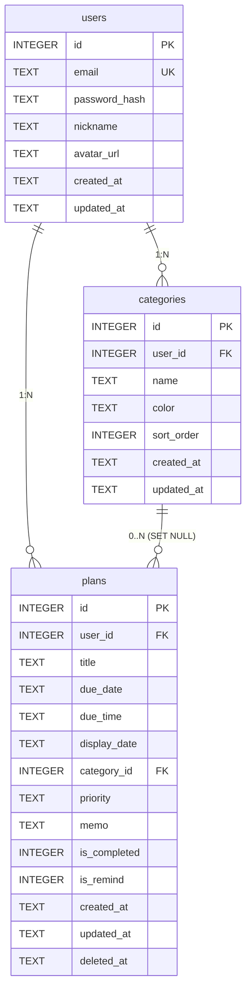

# PlanMate 데이터 모델

> 작성일: 2026-05-20
> 버전: 1.0
> 기반 문서: PRD v1.0 (§15, §16, §17, §18, §33)

---

## 0. 개요

| 항목 | 내용 |
|---|---|
| DB 엔진 | SQLite 3 |
| ORM | Prisma (SQLite 어댑터) |
| 스키마 파일 위치 | `backend/prisma/schema.prisma` |
| DB 파일 위치 | `backend/prisma/planmate.db` (환경변수 `DATABASE_URL`로 경로 변경 가능) |
| 문자 인코딩 | UTF-8 |
| 타임존 저장 방식 | KST 텍스트 직접 저장 (`YYYY-MM-DD`, `HH:mm`). UTC 변환 없음. |
| PK 전략 | `INTEGER PRIMARY KEY AUTOINCREMENT` |

[PRD 확정] DB: SQLite + Prisma, KST 텍스트 저장, AUTOINCREMENT PK — PRD §33

---

### 타임스탬프 저장 정책 (DB-02, DB-14)

**[DB-02, DB-14] `created_at` / `updated_at` / `deleted_at` 저장 규칙 확정:**

- `CURRENT_TIMESTAMP`는 SQLite에서 **UTC**를 반환하므로 KST 저장 정책과 충돌함.
- `@default(now())`는 Prisma에서 `DateTime` 타입에 대해 동작하며, `String` 타입에 적용 시 SQLite 어댑터 동작이 불일치할 수 있음.
- `@updatedAt`는 Prisma 공식적으로 `DateTime` 타입에서만 자동 갱신 보장. `String` 타입에서는 미보장.

**적용 규칙:**
1. `created_at`, `updated_at`, `deleted_at` 컬럼에 **DB 기본값(`CURRENT_TIMESTAMP`) 미사용**.
2. Prisma 스키마에서 `@default(now())` 및 `@updatedAt` **제거**.
3. 모든 타임스탬프는 **애플리케이션에서 `nowKST()` 호출 결과를 명시적으로 전달**하여 INSERT/UPDATE.
4. `nowKST()` 함수: `date-fns-tz`로 KST ISO 8601 문자열(`YYYY-MM-DDTHH:mm:ss`) 생성.

---

### SQLite FK pragma (DB-01)

**[DB-01] SQLite 외래 키 활성화 필수:**

SQLite는 기본적으로 외래 키 제약 검사를 **비활성화**함. `PRAGMA foreign_keys = ON`을 매 연결마다 실행하지 않으면 `ON DELETE CASCADE`, `ON DELETE SET NULL` 규칙이 실제로 동작하지 않음.

**적용 방법 (택일, 권장: A):**
- **(A) Prisma Client 초기화 시 실행 (권장):** `config/prisma.ts`에서 PrismaClient 초기화 후 `prisma.$executeRawUnsafe('PRAGMA foreign_keys = ON')` 호출.
- **(B) schema.prisma datasource 블록:** Prisma 5+ 버전에서 `relationMode = "foreignKeys"` 명시.

K-09=B(카테고리 삭제 시 `plans.category_id SET NULL`) 및 CASCADE 삭제가 이 설정 없이는 DB 레이어에서 무시됨.

---

## 1. ERD 개념도

```
[users] 1 ─────────────────────── N [plans]
   │                                    │
   │  user_id FK (ON DELETE CASCADE)    │  category_id FK (ON DELETE SET NULL)
   │                                    │
   └── 1 ──── N [categories] ──── 0..N ─┘

관계 요약:
- users 1:N plans       (user_id, CASCADE 삭제)
- users 1:N categories  (user_id, CASCADE 삭제)
- categories 0..N:N plans (category_id, SET NULL — K-09=B)
```



---

## 2. 엔티티: users

[PRD 확정] PRD §16

**설명:** 서비스 사용자 계정 정보. 프로필 데이터(닉네임, 아바타)도 동일 테이블에 저장.

### 2-1. 컬럼 정의

| 컬럼명 | 타입 | NULL 허용 | 기본값 | 제약 | 설명 |
|---|---|---|---|---|---|
| `id` | INTEGER | NOT NULL | autoincrement | PK | 기본키 |
| `email` | TEXT | NOT NULL | — | UNIQUE | 로그인 이메일 (max 254자) |
| `password_hash` | TEXT | NOT NULL | — | — | bcrypt 해시 (cost 12) |
| `nickname` | TEXT | NOT NULL | — | 2~20자 | 화면 표시 닉네임 |
| `avatar_url` | TEXT | NULL | NULL | — | 프로필 이미지 경로 (`/uploads/avatars/...`) |
| `refresh_token_hash` | TEXT | NULL | NULL | — | Refresh Token bcrypt 해시 (BE-01: 서버 측 무효화용. 로그아웃/재사용 감지 시 NULL) |
| `created_at` | TEXT | NOT NULL | DB 기본값 없음 | ISO 8601 KST | 가입 일시 (애플리케이션에서 `nowKST()` 필수 전달, DB-02) |
| `updated_at` | TEXT | NOT NULL | DB 기본값 없음 | ISO 8601 KST | 최종 수정 일시 (애플리케이션에서 `nowKST()` 필수 전달, DB-02·DB-14) |

### 2-2. 인덱스

| 인덱스명 | 컬럼 | 유형 | 목적 |
|---|---|---|---|
| `idx_users_email` | `email` | UNIQUE | 로그인 이메일 조회 |

### 2-3. 제약 및 규칙

- `email` UNIQUE: 중복 가입 방지. 애플리케이션 레벨에서 409 에러로 먼저 차단.
- `password_hash`: 원문 비밀번호 저장 금지. bcrypt cost 12 적용.
- `avatar_url`: NULL이면 클라이언트에서 기본 아바타(이니셜 또는 기본 이미지) 표시.
- `nickname` 공백 불가 조건: 애플리케이션 레벨(Zod)에서 검증.

### 2-4. Prisma 스키마 (의사 정의)

```prisma
// DB-02, DB-14: @default(now()) 및 @updatedAt 제거. 애플리케이션에서 nowKST() 명시 전달.
// BE-01: refresh_token_hash 컬럼 추가.
model User {
  id                 Int        @id @default(autoincrement())
  email              String     @unique
  passwordHash       String
  nickname           String
  avatarUrl          String?
  refreshTokenHash   String?    // BE-01: Refresh Token 서버 측 무효화용
  createdAt          String     // 애플리케이션에서 nowKST() 필수 전달 (DB-02)
  updatedAt          String     // 애플리케이션에서 nowKST() 필수 전달 (DB-14)

  plans              Plan[]
  categories         Category[]

  @@map("users")
}
```

---

## 3. 엔티티: categories

[PRD 확정] PRD §17, K-02=B, K-03=A

**설명:** 사용자별 일정 분류 카테고리. 회원가입 시 5개 기본 카테고리가 자동 생성됨.

### 3-1. 컬럼 정의

| 컬럼명 | 타입 | NULL 허용 | 기본값 | 제약 | 설명 |
|---|---|---|---|---|---|
| `id` | INTEGER | NOT NULL | autoincrement | PK | 기본키 |
| `user_id` | INTEGER | NOT NULL | — | FK → users(id), ON DELETE CASCADE | 소유 사용자 |
| `name` | TEXT | NOT NULL | — | 1~30자 | 카테고리 이름 |
| `color` | TEXT | NOT NULL | — | HEX 형식 `#RRGGBB` | 카테고리 색상 |
| `sort_order` | INTEGER | NOT NULL | `0` | 양의 정수 | 목록 표시 순서 |
| `created_at` | TEXT | NOT NULL | DB 기본값 없음 | ISO 8601 KST | 생성 일시 (애플리케이션에서 `nowKST()` 필수 전달, DB-02) |
| `updated_at` | TEXT | NOT NULL | DB 기본값 없음 | ISO 8601 KST | 최종 수정 일시 (애플리케이션에서 `nowKST()` 필수 전달, DB-02·DB-14) |

### 3-2. 인덱스

| 인덱스명 | 컬럼 | 유형 | 목적 |
|---|---|---|---|
| `idx_categories_user` | `user_id` | INDEX | 사용자별 카테고리 목록 조회 |

### 3-3. 제약 및 규칙

- `user_id` FK ON DELETE CASCADE: 사용자 삭제 시 카테고리도 함께 삭제.
- `color` 형식 검증: 애플리케이션 레벨(Zod `z.string().regex(/^#[0-9A-Fa-f]{6}$/)`)에서 처리.
- `sort_order` 관리: 추가 시 `MAX(sort_order) + 1`로 자동 배정. 재정렬은 PUT 시 수동 지정.
- **[DB-03] `(user_id, name)` 복합 UNIQUE 제약:** 동일 사용자 내 카테고리명 중복 금지. Prisma `@@unique([userId, name])`. 위반 시 에러 코드 `CATEGORY_NAME_ALREADY_EXISTS` (409 Conflict). 서비스 레이어에서 Prisma `P2002` 에러를 감지하여 변환.

### 3-4. Prisma 스키마 (의사 정의)

```prisma
// DB-02, DB-14: @default(now()) 및 @updatedAt 제거. 애플리케이션에서 nowKST() 명시 전달.
// DB-03: @@unique([userId, name]) 추가.
model Category {
  id        Int      @id @default(autoincrement())
  userId    Int
  name      String
  color     String
  sortOrder Int      @default(0)
  createdAt String   // 애플리케이션에서 nowKST() 필수 전달 (DB-02)
  updatedAt String   // 애플리케이션에서 nowKST() 필수 전달 (DB-14)

  user      User     @relation(fields: [userId], references: [id], onDelete: Cascade)
  plans     Plan[]

  @@unique([userId, name])              // DB-03: 동일 사용자 내 카테고리명 중복 금지
  @@index([userId])
  @@map("categories")
}
```

---

## 4. 엔티티: plans

[PRD 확정] PRD §15, K-07=B, K-09=B, K-10=B

**설명:** 메인 엔티티. 사용자의 일정·할 일 데이터. Soft Delete 적용.

### 4-1. 컬럼 정의

| 컬럼명 | 타입 | NULL 허용 | 기본값 | 제약 | 설명 |
|---|---|---|---|---|---|
| `id` | INTEGER | NOT NULL | autoincrement | PK | 기본키 |
| `user_id` | INTEGER | NOT NULL | — | FK → users(id), ON DELETE CASCADE | 소유 사용자 |
| `title` | TEXT | NOT NULL | — | 1~100자 | 일정 제목 |
| `due_date` | TEXT | NOT NULL | — | `YYYY-MM-DD` | 마감일 |
| `due_time` | TEXT | NULL | NULL | `HH:mm` 또는 NULL | 마감 시간 (선택) |
| `display_date` | TEXT | NOT NULL | — | `YYYY-MM-DD` | 오늘 할 일 표시 날짜 (K-10) |
| `category_id` | INTEGER | NULL | NULL | FK → categories(id), ON DELETE SET NULL | 카테고리 (K-09) |
| `priority` | TEXT | NOT NULL | `'normal'` | CHECK(`priority` IN ('high','normal','low')) | 중요도 |
| `memo` | TEXT | NULL | NULL | 0~500자 | 메모 (선택) |
| `is_completed` | INTEGER | NOT NULL | `0` | CHECK(`is_completed` IN (0,1)) | 완료 여부 (0=미완료, 1=완료) |
| `is_remind` | INTEGER | NOT NULL | `0` | CHECK(`is_remind` IN (0,1)) | 알림 희망 여부 (UI만, 미발송) |
| `created_at` | TEXT | NOT NULL | DB 기본값 없음 | ISO 8601 KST | 등록 일시 (애플리케이션에서 `nowKST()` 필수 전달, DB-02) |
| `updated_at` | TEXT | NOT NULL | DB 기본값 없음 | ISO 8601 KST | 최종 수정 일시 (애플리케이션에서 `nowKST()` 필수 전달, DB-02·DB-14) |
| `deleted_at` | TEXT | NULL | NULL | ISO 8601 KST 또는 NULL | Soft Delete 일시 |

### 4-2. 컬럼 상세 설명

**`display_date` (K-10=B)**
- 사용자가 직접 지정하는 "이 일정을 처리할 날짜"
- `due_date`(마감일)와 다를 수 있음. 예: 마감 5/25이지만 5/22에 미리 처리하고 싶은 경우 `display_date=2026-05-22`
- 폼 기본값: `due_date`와 동일하게 자동 설정, 사용자 수동 변경 가능
- 오늘 할 일 목록 필터 기준: `display_date = 오늘(KST)`
- **[DB-12] display_date ≤ due_date 검증 규칙 확정:**
  - `display_date`는 `due_date`보다 늦을 수 없음 (마감일 이후 처리 설정 불허).
  - 위반 시 422 에러: "처리 예정일은 마감일 이후로 설정할 수 없습니다."
  - 적용 위치: Zod 스키마 `.refine(data => data.displayDate <= data.dueDate, { message: '처리 예정일은 마감일 이후로 설정할 수 없습니다.', path: ['display_date'] })`.
  - 과거 날짜 `display_date` 허용 (PRD §12-3 기준).
  - SQLite CHECK 제약 미적용 — 애플리케이션 레벨(Zod)에서만 검증.

**`category_id` (K-09=B)**
- NULL 허용: 카테고리 삭제 시 FK ON DELETE SET NULL 규칙에 의해 NULL로 변환
- NULL인 경우 클라이언트에서 "미분류"로 표시

**`priority`**
- 가능한 값: `'high'` / `'normal'` / `'low'`
- DB CHECK 제약 + 애플리케이션 레벨(Zod) 이중 검증

**`is_completed` / `is_remind`**
- SQLite boolean 미지원으로 INTEGER(0/1) 사용
- Prisma에서 `Boolean` 타입으로 매핑하여 애플리케이션에서 `true`/`false` 사용

**`deleted_at`**
- NULL: 활성 레코드
- NOT NULL: 삭제된 레코드 (논리 삭제)
- 모든 조회 쿼리에 `WHERE deleted_at IS NULL` 조건 필수 포함
- Prisma 미들웨어 또는 `$extends`로 자동화 [AI 제안안]

### 4-3. 인덱스

| 인덱스명 | 컬럼 | 유형 | 목적 |
|---|---|---|---|
| `idx_plans_user_display` | `(user_id, display_date)` | COMPOSITE INDEX | 오늘 할 일 조회, 월간 display_date 필터 |
| `idx_plans_user_due` | `(user_id, due_date)` | COMPOSITE INDEX | 마감일 기준 캘린더 조회 |
| `idx_plans_deleted` | `deleted_at` | INDEX | Soft Delete 필터 최적화 |

### 4-4. Prisma 스키마 (의사 정의)

```prisma
// DB-02, DB-14: @default(now()) 및 @updatedAt 제거. 애플리케이션에서 nowKST() 명시 전달.
model Plan {
  id          Int       @id @default(autoincrement())
  userId      Int
  title       String
  dueDate     String
  dueTime     String?
  displayDate String
  categoryId  Int?
  priority    String    @default("normal")
  memo        String?
  isCompleted Boolean   @default(false)
  isRemind    Boolean   @default(false)
  createdAt   String    // 애플리케이션에서 nowKST() 필수 전달 (DB-02)
  updatedAt   String    // 애플리케이션에서 nowKST() 필수 전달 (DB-14)
  deletedAt   String?

  user        User      @relation(fields: [userId], references: [id], onDelete: Cascade)
  category    Category? @relation(fields: [categoryId], references: [id], onDelete: SetNull)

  @@index([userId, displayDate])
  @@index([userId, dueDate])
  @@index([userId, isCompleted])
  @@index([deletedAt])
  @@map("plans")
}
```

---

## 5. 관계 정리

[PRD 확정] PRD §15, §17

| 관계 | 참조 방향 | FK | 삭제 규칙 | 설명 |
|---|---|---|---|---|
| users 1:N plans | plans → users | `plans.user_id` | ON DELETE CASCADE | 사용자 삭제 시 모든 일정 삭제 |
| users 1:N categories | categories → users | `categories.user_id` | ON DELETE CASCADE | 사용자 삭제 시 모든 카테고리 삭제 |
| categories 0..N:plans | plans → categories | `plans.category_id` | ON DELETE SET NULL | 카테고리 삭제 시 연결 일정의 category_id = NULL |

**K-09=B 근거:** 카테고리 삭제 시 연결 일정도 삭제하지 않고 category_id만 NULL로 변경.
클라이언트에서 NULL category_id → "미분류" 회색 칩으로 표시.

---

## 6. 인덱스 전략

| 인덱스명 | 테이블 | 컬럼 | 목적 | 예상 쿼리 패턴 |
|---|---|---|---|---|
| `idx_users_email` | users | `email` | 로그인 시 이메일 조회 | `WHERE email = ?` |
| `idx_categories_user` | categories | `user_id` | 사용자별 카테고리 목록 | `WHERE user_id = ? ORDER BY sort_order` |
| `idx_plans_user_display` | plans | `(user_id, display_date)` | 오늘 할 일, 월간 display_date 필터 | `WHERE user_id = ? AND display_date = ?` |
| `idx_plans_user_due` | plans | `(user_id, due_date)` | 캘린더 마감일 기준 조회 | `WHERE user_id = ? AND due_date BETWEEN ? AND ?` |
| `idx_plans_deleted` | plans | `deleted_at` | Soft Delete 필터 | `WHERE deleted_at IS NULL` |

---

## 7. 초기 데이터 (시드)

[PRD 확정] PRD §17, K-02=B, K-03=A

### 7-1. 회원가입 시 기본 카테고리 5개 자동 생성

회원가입 트랜잭션 내에서 `users` INSERT 직후 아래 5개 카테고리를 해당 `user_id`로 INSERT:

| sort_order | name | color | 색상 설명 |
|---|---|---|---|
| 1 | 미팅 | `#7C3AED` | 보라 |
| 2 | 과제 | `#2563EB` | 파랑 |
| 3 | 시험 | `#DC2626` | 빨강 |
| 4 | 개인 일정 | `#16A34A` | 초록 |
| 5 | 약속 | `#EA580C` | 주황 |

- 색상 HEX 값은 PRD §12-1, §14-2에 명시된 확정값.
- 시드 생성은 `authService.register()` 내 트랜잭션(`prisma.$transaction`)으로 처리.
- 파일 위치: `backend/prisma/seed.ts`는 개발 환경 초기화용. 운영 시드는 서비스 코드에서 처리.

### 7-2. 시드 로직 위치

```
authService.register()
  └── prisma.$transaction([
        prisma.user.create({ data: { email, passwordHash, nickname } }),
        prisma.category.createMany({ data: [5개 기본 카테고리] })
      ])
```

---

## 8. 마이그레이션 전략

[PRD 확정] PRD §33-1

### 8-1. 명령어

| 환경 | 명령어 | 설명 |
|---|---|---|
| 개발 | `npx prisma migrate dev --name <이름>` | 마이그레이션 파일 생성 + DB 적용 |
| 운영 | `npx prisma migrate deploy` | 기존 마이그레이션 파일 적용만 |
| 리셋 (개발) | `npx prisma migrate reset` | DB 초기화 + 마이그레이션 재적용 + 시드 실행 |

### 8-2. 마이그레이션 파일 명명 규칙

```
backend/prisma/migrations/
  20260520000000_init_users_categories_plans/
    migration.sql
  20260601000000_add_index_plans_deleted/
    migration.sql
```

형식: `YYYYMMDDHHMMSS_<변경_내용_스네이크케이스>`

### 8-3. 주의사항

- SQLite는 컬럼 삭제/변경이 제한적. 타입 변경 시 테이블 재생성 방식(`shadow database`) 사용.
- `deleted_at` 컬럼은 추가되는 컬럼이므로 기존 레코드에 기본값 NULL 자동 적용.
- 향후 UTC 전환 시 날짜 필드 전체 마이그레이션 필요 — 현재 KST 텍스트 저장은 초기 버전 단순화 결정. [PRD 확정]
- **[DB-01] SQLite FK pragma 활성화 필수:** SQLite는 기본적으로 FK 검사 비활성. **Prisma 연결 시 매번 `PRAGMA foreign_keys = ON` 실행 필수.** 미실행 시 `ON DELETE CASCADE`, `ON DELETE SET NULL` 규칙이 DB 레이어에서 무시됨. `config/prisma.ts`에서 PrismaClient 초기화 후 `$executeRawUnsafe('PRAGMA foreign_keys = ON')` 호출 필수.

---

## 9. 애플리케이션 레벨 데이터 규칙

### 9-1. Soft Delete 자동화

- Prisma `$extends`를 사용하여 `plan.findMany`, `plan.findFirst`, `plan.findUnique` 쿼리에 `WHERE deleted_at IS NULL` 조건 자동 삽입 [AI 제안안]
- 또는 모든 Repository 함수에서 명시적으로 `where: { deletedAt: null }` 포함 (명시적 방식 선택 시 누락 위험 있음)

### 9-2. 카멜케이스 변환

- DB 컬럼명: snake_case (`user_id`, `due_date`, `is_completed`)
- Prisma 모델 필드명: camelCase (`userId`, `dueDate`, `isCompleted`)
- API 응답: camelCase (`dueDate`, `displayDate`, `isCompleted`)

### 9-3. updated_at 갱신 정책 (DB-14 수정)

- **[DB-14] `@updatedAt` 제거됨.** 모든 UPDATE 시 애플리케이션에서 `nowKST()` 호출 결과를 `updatedAt` 필드에 명시적으로 전달.
- 동일 값으로 PATCH 요청 시에도 `updated_at` 갱신됨. [PRD 확정]
- 구현 위치: 각 `repository.update()` 함수에서 `data: { ...fields, updatedAt: nowKST() }` 패턴으로 처리.

---

### 9-4. 검색 규칙 (DB-06)

**[DB-06] 검색 동작 규칙 확정:**

| 항목 | 규칙 |
|---|---|
| 검색 범위 | 전체 미삭제 레코드 (`deleted_at IS NULL`). 현재 조회 월(`month` 파라미터) 한정 없음. |
| 검색 대상 컬럼 | `title`, `memo` (OR 조건: 어느 하나라도 포함 시 반환) |
| 검색 방식 | SQLite LIKE `%keyword%` (전체 일치 포함, 부분 문자열 검색) |
| 한국어 처리 | SQLite LIKE는 한국어 **정확 매칭만 지원**. 부분 자모 분리 검색 불가 ("영처" 검색으로 "영상처리" 찾기 불가). 이는 MVP의 명시적 제한 사항. |
| 영문 대소문자 | `COLLATE NOCASE`는 ASCII에만 적용. 영문 키워드 대소문자 무시 적용. 한국어는 정확 매칭. |
| FTS5 | MVP 미도입 결정. 향후 검색 성능/품질 요구 시 FTS5 가상 테이블 도입 검토. |
| 검색 결과 정렬 | BE-03과 동일한 서버 고정 정렬 순서 적용 (is_completed → priority → due_time → created_at). |

---

### 9-5. 필터 조합 규칙 (DB-07)

**[DB-07] 다중 필터 AND/OR 조합 규칙 확정:**

| 필터 그룹 | 선택 방식 | 그룹 내 조합 | 그룹 간 조합 |
|---|---|---|---|
| 카테고리 (`category`) | 다중 선택 | OR | AND (다른 그룹과) |
| 중요도 (`priority`) | 다중 선택 | OR | AND (다른 그룹과) |
| 완료 여부 (`completed`) | 단일 선택 | — | AND (다른 그룹과) |
| 미분류 (`uncategorized=1`) | 단일 선택 | 카테고리 그룹과 OR | AND (완료·중요도 그룹과) |

**미분류 필터링:**
- `?uncategorized=1` 파라미터로 `category_id IS NULL` 일정 조회
- `?category=1&uncategorized=1`: `category_id = 1 OR category_id IS NULL` (OR 조건)
- 카테고리 칩 UI에서 "미분류" 옵션 선택 시 `uncategorized=1` 파라미터 전송

---

### 9-6. 카테고리 삭제 트랜잭션 순서 (DB-09)

**[DB-09] 카테고리 삭제 트랜잭션 실행 순서 확정:**

FK pragma 활성화(`PRAGMA foreign_keys = ON`) 상태에서도 안전한 순서:

1. `planRepository.updateMany({ where: { categoryId: id, userId }, data: { categoryId: null, updatedAt: nowKST() } })` — plans의 FK 먼저 NULL 처리
2. `categoryRepository.delete(id)` — categories 레코드 삭제

```
prisma.$transaction([
  prisma.plan.updateMany({ where: { categoryId: id }, data: { categoryId: null } }),  // 1순위
  prisma.category.delete({ where: { id } })                                           // 2순위
])
```

- Prisma `$transaction` 배열의 **선언 순서 = 실행 순서**.
- FK pragma 활성 시 categories 삭제 전에 plans FK가 NULL이어야 FK 위반 방지.
- 위 순서를 반드시 준수할 것.
